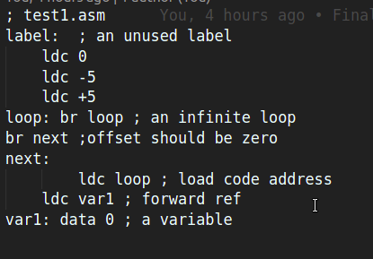

# SIMPLE ASSEMBLER AND EMULATOR
## ASSEMBLER

1. All files are separated semantically according to the nature of the functions and the data they access. 
    - Functions/
                - Comment.c : Functions related to comment detection and comment removal
                - Utilities.c :  General helper functions required during various operations
    - asm.c : Main file which has all the includes and the main function. The main file includes functions for initializing and parse1 and 
    parse2. It also deals with opening the file and reading it. 
    - constants.c : Initialization and # define of constants needed throughout program
    - error.c : Structure for storing errors and related functions for pushing and printing errors
    - label.c : Structure for storing the labels and related functions for extracting and detecting the labels
    - mnemonic.c : Structure for storing the mnemonics and related functions for initializing and detecting and formatting mnemonics
    - operand.c : Structure for operand 
    - parsedCode.c : Structure for the parsed code and related functions
    - warning.c : Structure for warnings and related functions, pretty similar to errors. 

2. Working: 
    - The file is read and parsed using first parse and stored in the structure with separation.
    - The parse1 parses the sentence and and stores the line number, label, operator and operand and also stores some errors which can be stored at this stage
    - The parse 2 detects all errors and warnings using different logic.
    - If there are errors only the error file is created
    - If there are no errors then the listing file, machine code file and the warnings file is created. 

3. Compilation
```
In dir ~/Desktop/simple-assembler/project
cd simple-assembler
gcc -std=c89 -pedantic -W -Wall -Wpointer-arith asm.c 

```

4. Assembling a file 
```
./asm ../test1/test.asm
```

5. Examples 

## Assembly file


## Listing file


## Warning file


## Error log file


# Emulator
The emulator runs the assembly file in a machine which exists only in the emulator. The characteristics of the machine are
1. 100000 * 4 bytes of memory
2. Stack Pointer
3. Program Counter
4. Register A
5. Register B.

Any program which runs on the emulator makes changes to the internal state of the machine, which constitutes the above mentioned. 
The emulator has the following features
- trace: Trace the execution of the program line by line using two methods
    - Trace line by line : by pressing on any character apart from the 'c' or 'q', the program executes line by line
    - By pressing 'c' the program executes the remaining lines at once.
    - By pressing 'q', the program is exited, note that none of the internal state is reset when program is quit, if we run trace again, it starts from the same program counter.
- wipe: Resets the internal state apart from memory to 0
- before: Displays memory dump before the program executed
- after: Displays the memory dump after the program executed
- read: Displays all the reads that took place while the program was run
- write: Displays all the reads that took place while the program was run


### Trace


### Read


### Write


### Before/After


### Reading the object file from hexdump 
For getting the hexdump in integer format with endlines.
Example:  
```
hexdump -v -e '1/4 "%08X\n"' ./test_bubble/bubble.o

Output:
00100000
0000000B
FFFFFF0A
00000A00
00000003
00004100
0000010D
00000012
FFFFFF0A
00000003
00000203
FFFFFD0A
00000000
00000003
00000100
00000103
00000000
00000203
00000402
00000202
00000007
00000100
00000007
0000260F
00000100
00000103
00000402
00000202
00000007
00000102
00000007
0000160F
00000502
00000004
00000000
00000104
00000007
00000110
00000A11
00000502
00000004
00000003
00000502
00000104
00000502
00000005
00000002
00000502
00000105
00000100
00000102
00000006
00000103
FFFFE411
00000100
00000202
00000006
00000203
00000100
00000502
00000006
FFFFD411
00000302
0000050A
0000000E
DEADBEEF
5EEDBED5
C0EDBABE
5EAF00D5
AB5C155A
CA5CADED
FEEDFACE
C0C0F00D
DECEA5ED
50FABED5

```